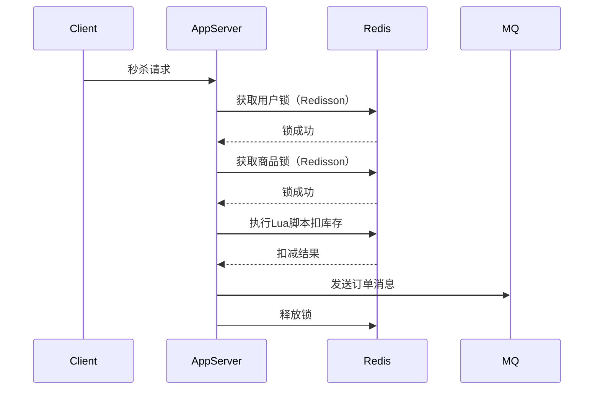
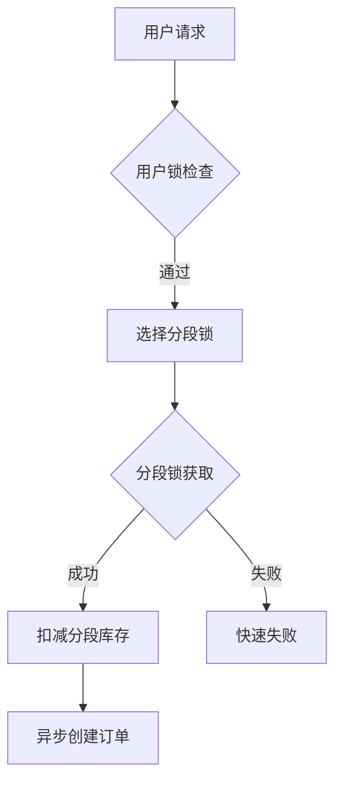

# Demo redis lua script in java

## Basic Demo

这是一个完整的 Java 程序示例，使用 **Jedis** 客户端执行 Redis Lua 脚本实现**原子性库存扣减**，包含异常处理和脚本复用优化。

---

### **1. 准备工作**
#### 依赖配置（Maven）
```xml
<dependency>
    <groupId>redis.clients</groupId>
    <artifactId>jedis</artifactId>
    <version>4.3.1</version>
</dependency>
```

---

### **2. Java 代码实现**
#### （1）库存扣减 Lua 脚本
将脚本保存为字符串常量（支持参数化）：
```java
public class RedisStockScript {
    // Lua 脚本：检查库存并扣减（原子性操作）
    private static final String STOCK_DEDUCTION_SCRIPT =
            "local stock_key = KEYS[1] " +
            "local stock = tonumber(redis.call('GET', stock_key)) " +
            "if stock > 0 then " +
            "    redis.call('DECR', stock_key) " +
            "    return 1 " +  // 扣减成功
            "end " +
            "	return 0 ";  // 库存不足
}
```

#### （2）执行脚本的 Java 方法
```java
import redis.clients.jedis.Jedis;
import redis.clients.jedis.JedisPool;
import redis.clients.jedis.JedisPoolConfig;

public class RedisStockScript {
    private static final String REDIS_HOST = "127.0.0.1";
    private static final int REDIS_PORT = 6379;
    private static JedisPool jedisPool;

    static {
        // 初始化 Redis 连接池
        JedisPoolConfig poolConfig = new JedisPoolConfig();
        poolConfig.setMaxTotal(10);  // 最大连接数
        jedisPool = new JedisPool(poolConfig, REDIS_HOST, REDIS_PORT);
    }

    /**
     * 扣减库存（原子性操作）
     * @param key Redis 中的库存键（如 "product:1001:stock"）
     * @return true 扣减成功，false 库存不足或失败
     */
    public static boolean deductStock(String key) {
        try (Jedis jedis = jedisPool.getResource()) {
            // 执行 Lua 脚本
            Object result = jedis.eval(
                    STOCK_DEDUCTION_SCRIPT,
                    1,  // KEYS 的数量
                    key  // KEYS[1]
            );

            // 脚本返回 1 表示扣减成功
            return Long.valueOf(1).equals(result);
        } catch (Exception e) {
            System.err.println("Redis 操作异常: " + e.getMessage());
            return false;
        }
    }

    public static void main(String[] args) {
        String stockKey = "product:1001:stock";

        // 初始化库存（测试用）
        try (Jedis jedis = jedisPool.getResource()) {
            jedis.set(stockKey, "10");  // 初始库存为 10
        }

        // 模拟并发扣减
        for (int i = 0; i < 15; i++) {
            boolean success = deductStock(stockKey);
            System.out.printf("扣减尝试 %d: %s%n", i + 1, success ? "成功" : "失败");
        }
    }
}
```

---

### **3. 关键点解析**
#### （1）**Lua 脚本的原子性**
- 脚本中的 `GET` 和 `DECR` 操作是**连续执行**的，Redis 保证不会被其他命令打断。
- 无需额外使用 `WATCH` 或事务，避免竞态条件。

#### （2）**脚本复用优化**
如果需要频繁调用脚本，可以先用 `SCRIPT LOAD` 缓存脚本，再通过 `EVALSHA` 执行：
```java
// 在初始化时加载脚本
private static final String SCRIPT_SHA;
static {
    try (Jedis jedis = jedisPool.getResource()) {
        SCRIPT_SHA = jedis.scriptLoad(STOCK_DEDUCTION_SCRIPT);
    }
}

// 通过 SHA1 执行脚本
Object result = jedis.evalsha(SCRIPT_SHA, 1, key);
```

#### （3）**异常处理**
- 捕获 `JedisConnectionException` 处理网络问题。
- 捕获 `NumberFormatException` 处理库存值非数字的情况（可在 Lua 脚本中提前校验）。

---

### **4. 测试输出示例**
运行 `main` 方法后，输出如下（初始库存为 10）：
```
扣减尝试 1: 成功
扣减尝试 2: 成功
...
扣减尝试 10: 成功
扣减尝试 11: 失败  // 库存不足
...
扣减尝试 15: 失败
```

---

### **5. 扩展场景**
#### （1）**带最小扣减单位的脚本**
如果需要每次扣减 N 个库存（如购买多件商品）：
```lua
local stock_key = KEYS[1]
local deduct_num = tonumber(ARGV[1])  -- 从 ARGV 获取参数
local stock = tonumber(redis.call('GET', stock_key))
if stock >= deduct_num then
    redis.call('DECRBY', stock_key, deduct_num)
    return 1
end
	return 0
```
Java 调用：
```java
//               keyCount       key         argv
jedis.eval(script, 1, "product:1001:stock", "3");  // 每次扣减 3 个
```

#### （2）**分布式锁 + 脚本**
极端高并发下，可结合分布式锁（Redisson）和 Lua 脚本：
```java
RLock lock = redisson.getLock("stock_lock");
try {
    lock.lock();
    boolean success = deductStock(key);
    // ...
} finally {
    lock.unlock();
}
```

---

### **总结**
- **核心优势**：Lua 脚本在 Redis 中天然原子，避免超卖问题。
- **性能建议**：使用 `EVALSHA` 复用脚本，连接池管理资源。

如果需要进一步优化（如集群模式、Spring Boot 集成），可以在此基础上扩展。


## 问题：why 极端高并发下，可结合分布式锁（Redisson）和 Lua 脚本

在极端高并发场景下，虽然 Redis Lua 脚本本身具有原子性，但结合分布式锁（如 Redisson）仍然是必要的，原因涉及 **性能隔离**、**防重入**、**系统保护** 等多个维度。以下是详细分析：

---

### **1. Redis Lua 脚本的局限性**
尽管 Lua 脚本能保证 **单个键操作的原子性**，但在以下场景仍需分布式锁：
#### （1）**跨键操作的原子性**
- **问题**：如果业务需要同时修改多个键（如扣减库存 + 记录订单），Lua 脚本只能保证单个键的原子性，无法跨键事务。
- **示例**：

  ```lua
  -- 无法保证以下两个操作的原子性（除非所有键在同一个 Redis 分片）
  redis.call('DECR', KEYS[1])  -- 扣减库存
  redis.call('HSET', KEYS[2], "order_id", ARGV[1])  -- 记录订单
  ```
- **解决方案**：用分布式锁包裹整个业务逻辑，保证跨键操作的串行化。

#### （2）**非 Redis 操作的扩展性**
- **问题**：如果扣减库存后还需操作数据库、调用外部服务等，Lua 脚本无法覆盖这些操作。
- **示例**：

  ```java
  boolean success = deductStock(key); // Lua 脚本扣减 Redis 库存
  if (success) {
      orderDao.createOrder(...); // 非原子操作，可能失败
  }
  ```
- **风险**：Redis 库存扣减成功但数据库操作失败，导致数据不一致。
- **解决方案**：用分布式锁保证 Redis 操作和数据库操作的原子性。

---

### **2. 分布式锁的核心作用**
#### （1）**临界区串行化**
- **场景**：极端高并发（如秒杀 10 万 QPS）时，即使 Lua 脚本能避免超卖，大量请求会直接冲击 Redis。
- **问题**：Redis 单线程处理所有请求，可能导致：
  - 网络带宽打满
  - Redis CPU 飙升至 100%
  - 脚本执行超时（默认 5 秒）
- **解决方案**：用分布式锁在应用层控制并发请求量，例如限制 1000 QPS 进入 Redis。

#### （2）**防重复请求**
- **场景**：用户频繁点击提交订单按钮，导致重复扣减。
- **Lua 脚本的不足**：脚本无法识别请求是否来自同一用户。
- **解决方案**：锁键绑定用户 ID，例如：

  ```java
  String lockKey = "user_order_lock:" + userId;
  RLock lock = redisson.getLock(lockKey);
  lock.lock(2, TimeUnit.SECONDS); // 防重入锁
  ```

#### （3）**避免死锁和锁竞争**
- **Redisson 的优势**：相比手动实现锁（如 `SETNX + EXPIRE`），Redisson 提供：
  - **自动续期**：防止业务未执行完锁过期。
  - **可重入性**：同一线程可重复获取锁。
  - **公平锁**：避免线程饥饿。

---

### **3. 最佳实践：Lua 脚本 + 分布式锁**
#### （1）**代码示例**
```java
public class SecKillService {
    private final RedissonClient redisson;
    private final JedisPool jedisPool;

    public boolean seckill(String productKey, String userId) {
        // 1. 获取用户级分布式锁（防重复提交）
        String userLockKey = "seckill:user:" + userId;
        RLock userLock = redisson.getLock(userLockKey);
        if (!userLock.tryLock(0, 10, TimeUnit.SECONDS)) {
            throw new RuntimeException("操作过于频繁");
        }

        try {
            // 2. 获取商品级分布式锁（控制并发量）
            String productLockKey = "seckill:product:" + productKey;
            RLock productLock = redisson.getLock(productLockKey);
            if (!productLock.tryLock(0, 500, TimeUnit.MILLISECONDS)) {
                throw new RuntimeException("秒杀太火爆了");
            }

            try (Jedis jedis = jedisPool.getResource()) {
                // 3. 执行 Lua 脚本扣减库存
                String script = "local stock = tonumber(redis.call('GET', KEYS[1])) " +
                               "if stock > 0 then redis.call('DECR', KEYS[1]) return 1 else return 0 end";
                Long result = (Long) jedis.eval(script, 1, productKey);

                if (result == 1) {
                    // 4. 异步处理订单（非阻塞主流程）
                    sendOrderToMQ(userId, productKey);
                    return true;
                }
            } finally {
                productLock.unlock(); // 必须释放商品锁！ 原因见后文注释。
            }
        } finally {
            userLock.unlock();
        }
        return false;
    }
}
/*
如果未手动释放锁，Redisson 的 watchdog 机制会在超时（默认 30 秒）后自动释放，但会导致：
- 锁泄漏：其他线程需等待超时才能获取锁。
- 性能下降：在高并发下，未释放的锁会形成堆积。
*/
```

#### （2）**架构设计**


#### （3）**参数调优建议**
| 组件      | 配置项                | 推荐值       | 说明            |
| --------- | --------------------- | ------------ | --------------- |
| Redisson  | `lockWatchdogTimeout` | 30秒         | 锁自动续期时间  |
| Redis     | `lua-time-limit`      | 500毫秒      | Lua脚本超时时间 |
| JedisPool | `maxTotal`            | 500          | 根据并发量调整  |
| 分布式锁  | `tryLock` 超时时间    | 商品锁 500ms | 避免长时间阻塞  |

---

### **4. 为什么不只用 Lua 脚本？**
| 场景          | 纯 Lua 脚本的问题        | 锁 + Lua 脚本的优势       |
| ------------- | ------------------------ | ------------------------- |
| 跨键操作      | 无法保证原子性           | 锁保证多键操作的串行化    |
| 非 Redis 操作 | 无法覆盖数据库、MQ等操作 | 锁扩展了原子边界          |
| 超高频并发    | Redis 单线程可能被打挂   | 锁控制进入 Redis 的请求量 |
| 重复请求      | 无法识别用户重复提交     | 用户级锁防重              |

---

### **5. 总结**
- **Lua 脚本**：解决 **单个 Redis 键操作的原子性**（如库存扣减）。
- **分布式锁**：解决 **跨键/跨系统操作的原子性** + **系统过载保护** + **防重入**。
- **组合使用**：
  **“锁粗化”**（控制并发入口） + **“Lua 细化”**（保证 Redis 操作原子性） = 高并发安全。


## 问题 3：上面代码中 why consider user & product 锁? redis 锁如何保证非常高的并发流量?


### **1. 为什么需要用户锁（User Lock）和商品锁（Product Lock）？**
#### **（1）用户锁（防重入）**
- **作用**：防止同一用户短时间内重复提交请求（如疯狂点击秒杀按钮）。
- **场景**：
  - 用户连续点击 10 次，只有第一次请求能进入核心逻辑。
  - 避免重复扣减库存、重复创建订单。
- **锁键设计**：`seckill:user:{userId}`（绑定用户唯一标识）。
- **锁超时时间**：通常较短（如 2-10 秒），仅需覆盖用户操作间隔。

#### **（2）商品锁（控并发）**
- **作用**：限制对同一商品的并发操作量，保护 Redis 和下游系统。
- **场景**：
  - 商品 A 的库存为 100，但瞬时 1 万 QPS 直接打向 Redis，即使 Lua 脚本能保证原子性，Redis 可能因负载过高崩溃。
  - 通过商品锁将并发限制在可控范围（如 500 QPS）。
- **锁键设计**：`seckill:product:{productId}`（绑定商品唯一标识）。
- **锁超时时间**：极短（如 500ms），仅需覆盖 Lua 脚本执行时间。

#### **（3）双锁分工**
| 锁类型 | 目标                       | 锁粒度             | 超时时间  |
| ------ | -------------------------- | ------------------ | --------- |
| 用户锁 | 保证用户级请求幂等性       | 细粒度（用户维度） | 2-10 秒   |
| 商品锁 | 保护系统不被超高频并发打挂 | 粗粒度（商品维度） | 100-500ms |


---

### *2. Redis 锁如何应对极端高并发？**
#### **（1）锁的优化策略**
| 策略               | 实现方式                                               | 作用                                                         |
| ------------------ | ------------------------------------------------------ | ------------------------------------------------------------ |
| **分段锁**         | 将商品锁拆分为 N 个子锁（如 `product:1001:segment:1`） | 将并发压力分散到多个锁，提升并行度（如库存 1000 拆分为 10 个 100 的子库存）。 |
| **锁超时动态调整** | 根据 Redis 负载动态缩短锁超时时间                      | 避免锁占用时间过长导致系统吞吐下降。                         |
| **非阻塞尝试锁**   | 使用 `tryLock(0, timeout, unit)` 而非 `lock()`         | 立即失败返回而非阻塞，快速拒绝超量请求。                     |

#### **（2）代码示例：分段锁 + 动态超时**
```java
public boolean seckillWithSegment(String productKey, String userId, int segments) {
    // 1. 用户锁防重
    String userLockKey = "seckill:user:" + userId;
    RLock userLock = redisson.getLock(userLockKey);
    if (!userLock.tryLock(0, 10, TimeUnit.SECONDS)) {
        return false;
    }

    try {
        // 2. 随机选择一个分段锁（降低冲突概率）
        int segment = ThreadLocalRandom.current().nextInt(segments);
        String segmentLockKey = "seckill:product:" + productKey + ":segment:" + segment;
        RLock segmentLock = redisson.getLock(segmentLockKey);

        // 3. 动态超时：根据系统负载调整（示例简化）
        long lockTimeout = calculateDynamicTimeout(); // 例如 100ms ~ 500ms
        if (!segmentLock.tryLock(0, lockTimeout, TimeUnit.MILLISECONDS)) {
            return false;
        }

        try (Jedis jedis = jedisPool.getResource()) {
            // 4. 操作分段库存的 Lua 脚本
            String segmentStockKey = "stock:" + productKey + ":segment:" + segment;
            String script = "local stock = tonumber(redis.call('GET', KEYS[1])) " +
                           "if stock > 0 then redis.call('DECR', KEYS[1]) return 1 else return 0 end";
            Long result = (Long) jedis.eval(script, 1, segmentStockKey);

            if (result == 1) {
                sendOrderToMQ(userId, productKey);
                return true;
            }
        } finally {
            segmentLock.unlock();
        }
    } finally {
        userLock.unlock();
    }
    return false;
}
```

#### **（3）架构设计优化**


---

### **4. 极端并发下的保底措施**
#### **（1）熔断降级**
- 监控 Redis 和锁的竞争情况，当阈值突破时：
  - 直接返回“活动太火爆”页面。
  - 启用本地缓存库存（最终一致性）。

#### **（2）异步化处理**
- 扣减库存成功后，订单创建通过消息队列（如 Kafka）异步处理，避免阻塞主流程。
- 示例：
  ```java
  if (deductStock(productKey)) {
      kafkaTemplate.send("order-events",
          new OrderEvent(userId, productKey).toString());
  }
  ```

#### **（3）库存预热**
- 活动前将库存加载到 Redis，并设置过期时间。
- 使用 `INITSTOCK` 命令初始化，避免首次请求穿透到数据库。

---

### **总结**
- **用户锁**：解决幂等性问题，避免用户重复请求。
- **商品锁**：控制系统并发量，保护 Redis 和下游服务。
- **分段锁**：提升并行度，适用于超高并发场景。
- **锁释放**：必须显式释放，否则会导致性能瓶颈。
- **保底策略**：熔断 + 异步化 + 预热是应对极端流量的关键。

